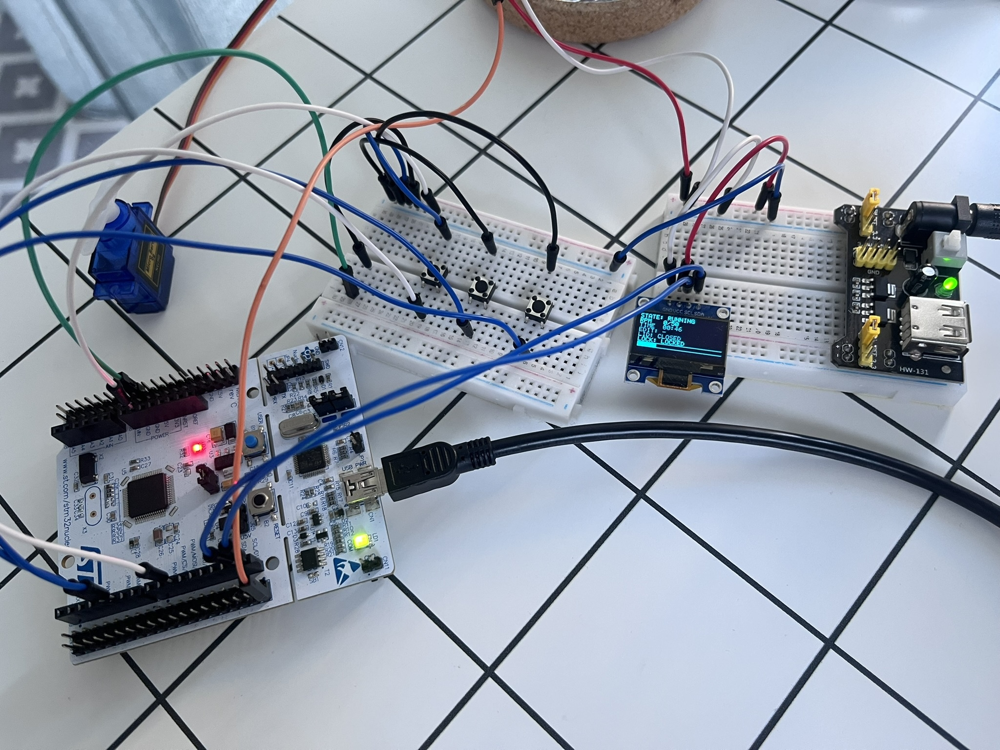
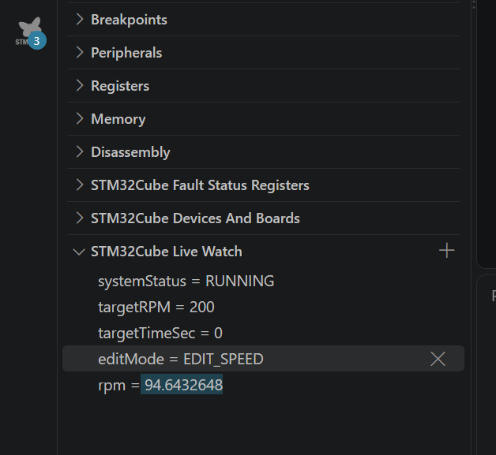
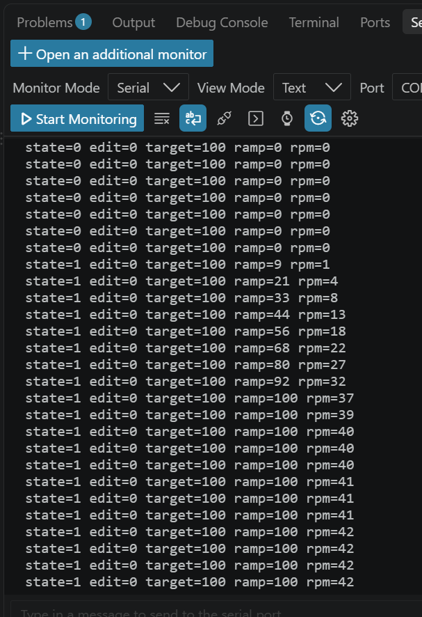
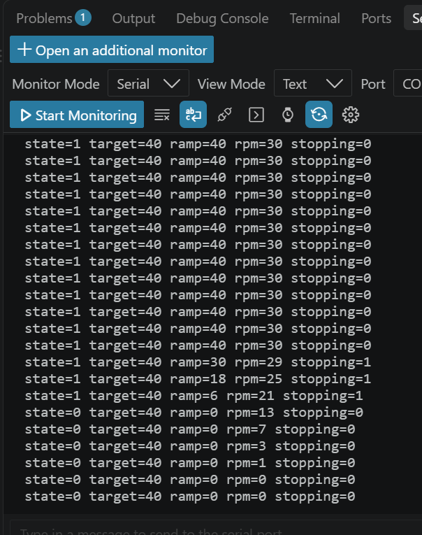

# STM32_Medical_Device_EncoderDC

Celem tego projektu było napisanie firmware'u na STM32 obejmującego sterowanie silnikiem DC z enkoderem wraz z ręcznie napisanym regulatorem PID. Logikę sterowania podpiąłem pod projekt urządzenia medycznego -> wirówki laboratoryjnej, czyli urządzenia do przygotowywania próbek, wykorzystywanego w laboratoriach do rozdzielania składników mieszanin na podstawie różnic w ich gęstości za pomocą siły odśrodkowej. Udało mi się napisać kompletny kod obsługujący to urządzenie, łączący zarówno sterowanie silnikiem, jak i bezpośrednią obsługę przez przyciski, logikę pokrywy i zamka (servo) oraz wyświetlanie informacji o bieżącym stanie systemu na ekranie OLED SSD1306.

The goal of this project was to develop firmware for an STM32 microcontroller to control a DC motor equipped with an encoder, utilizing a custom-written PID controller. I integrated this control logic into a medical device -> a laboratory centrifuge, which is a device used for sample preparation and the separation of mixture components based on density differences via centrifugal force. I successfully developed fully functional code to operate the device, integrating motor control, user input via buttons, lid and lock (servo) logic, and system status display (OLED SSD1306).

## Overview

An embedded controller for a small lab centrifuge on a NUCLEO-F446RE. The user sets a target RPM and run time with three buttons and starts with a fourth. The system ramps the motor up, holds speed under a PID loop, ramps back down automatically once the time elapses, and only then releases a servo-driven physical lock on the lid. Encoder speed and system state are shown live on an SSD1306 OLED.

The real motor and DRV8871 driver were never connected during this build. The encoder and buttons were validated with real hardware (a KY-040 rotary encoder standing in for the motor's own encoder), and the PID/ramp/state-machine logic was validated instead with a software motor model (`SIMULATION_MODE` in `main.c`).

## How it came together

One piece at a time, tested before moving on to the next:

1. **Encoder** — TIM2 in hardware quadrature mode (x4), tested first with a plain rotary encoder before the real motor existed.
2. **Buttons** — polled and debounced rather than EXTI, so a press-and-hold auto-repeat is possible. One dedicated Start/E-STOP button stays on EXTI.
3. **PID + ramp** — a from-scratch P+I+D with anti-windup, driven through a rate-limited ramp so the setpoint — and so the motor — never jumps.
4. **Time-based stop** — counts down the configured run time, then ramps back to 0 instead of cutting power outright.
5. **E-STOP** — a state flag alone doesn't stop a motor; PWM has to be zeroed in the same interrupt that flips the state.
6. **Lid interlock** — blocks Start while the lid is open, forces E-STOP if it's opened mid-run.
7. **Servo lock** — physically locks the lid on Start, and only releases it once the motor is confirmed stopped (or a max-wait timeout passes, in case the RPM reading itself gets stuck).
8. **OLED (SSD1306)** — state, RPM, remaining time, lock/lid status, all on a driver written from scratch.

## Hardware

| Function | Peripheral | Notes |
|---|---|---|
| Encoder | TIM2 | Quadrature x4; Pololu 4752 motor encoder, or a KY-040 for testing |
| Motor PWM | TIM1 CH1/CH2 | 20 kHz, drives a DRV8871 in sign-magnitude mode |
| PID / RPM / button base clock | TIM6 | 100 Hz |
| Lock servo (SG90) | TIM3 CH3 | Standard 1-2 ms servo PWM |
| OLED | I2C1 | SSD1306 128x64 |
| Start / E-STOP | EXTI (PC13) | Same button, meaning depends on system state |
| +/- and mode buttons | Polled GPIO | Debounced, hold-to-repeat after 500 ms |
| Lid switch | Polled GPIO | Checked every TIM6 tick |

## Testing without the real motor

Three checks from the software motor simulation, logged over UART.

**Live Watch during a run** — encoder/PID state read straight from RAM mid-test.

**Acceleration ramp** — `ramp` climbing at a fixed rate while `rpm` follows it with the simulated motor's own lag.

**Smooth stop** — `stopping` flips to 1, `ramp` — and then `rpm` — comes back down to 0 instead of being cut immediately.

## Known limitations

- **No real motor tested yet.** `Kp`/`Ki`/`Kd` are starting values from the simulation, not tuned on hardware.
- **UI speed range (up to 6000 RPM) exceeds what the actual motor can do (~330 RPM).** Kept for a more realistic step size/UX, not because the hardware supports it.
- **No status LEDs.** A finished device would probably want a red/yellow/green indicator, but nothing I set out to learn here (encoder, PID, interrupts, state machines) actually needed one, so I left it out.
- **Breadboard, not a PCB.** Long jumper wires caused real debounce problems during testing, worked around in software (`DEBOUNCE_TICKS`), but a PCB would remove the issue at the source.
